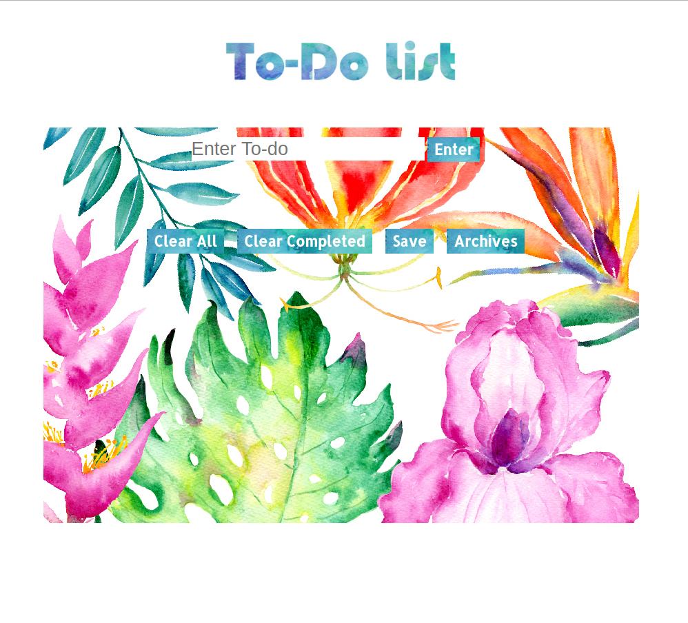

# Todo List
Build a Simple Todo List

**Link to project:** https://boring-kilby-e4acbc.netlify.com

## How It's Made:

**Tech used:** HTML5, CSS3, JavaScript.
Styling for this project was done using a CSS Grid layout. Written in vanilla Javascript.

## Lessons Learned:
Learned about event propragation and how to change behavior for elements in Javascript that were not hard coded in the HTML.  Also learned how to save the user input data to local storage.

## Examples:

**OOP Calculator:** https://github.com/Eriquette/week01-alumni-project-calculator/tree/answer

**Carousel Picture Gallery:** https://github.com/Eriquette/carousel-bootcamp2018c-week05/blob/answer

**Daily Code Challenges:** https://github.com/Eriquette/Daily-Code-Challenges
