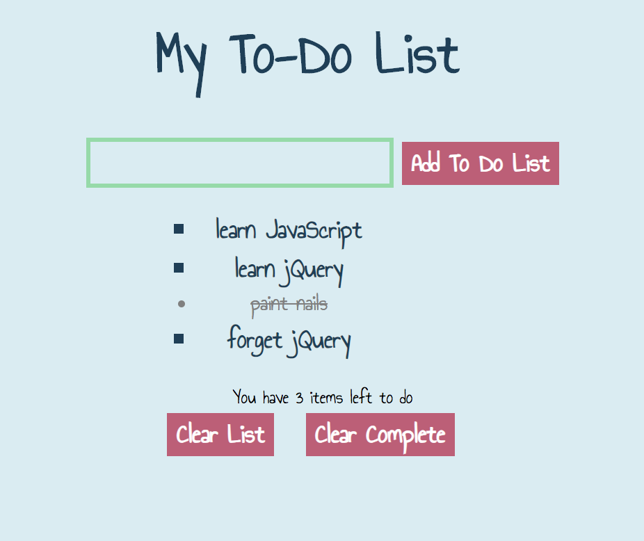

# My To-Do List
This project is a to-do list for users to enter items and remove items once completed.

**Link to project:** https://tender-ritchie-caee3b.netlify.com/

## How It's Made:

**Tech used:** HTML, CSS, JavaScript

Using JavaScript I designed a simple navigation between an array of images. When the user clicks "next" the image source would be updated to the next image in the array. When the user clicks "back" the image source would be updated with the previous image in the array. It was necessary to consider edge cases such as when the user has reached the end of the array and clicks "next", or when they have reached the first index and click "back"

## Optimizations

One feature I would like to add to this project is the ability for users to delete or add new images into the carousel.

## Lessons Learned:

Looping through an array continuously!

## Examples:
Take a look at these couple examples that I have in my own portfolio:

**Carousel:** https://mystifying-stallman-5862e0.netlify.com/

**Attendance List:** https://sleepy-franklin-b8d685.netlify.com/

**Slot Machine:** https://github.com/alecortega/patch-panel
